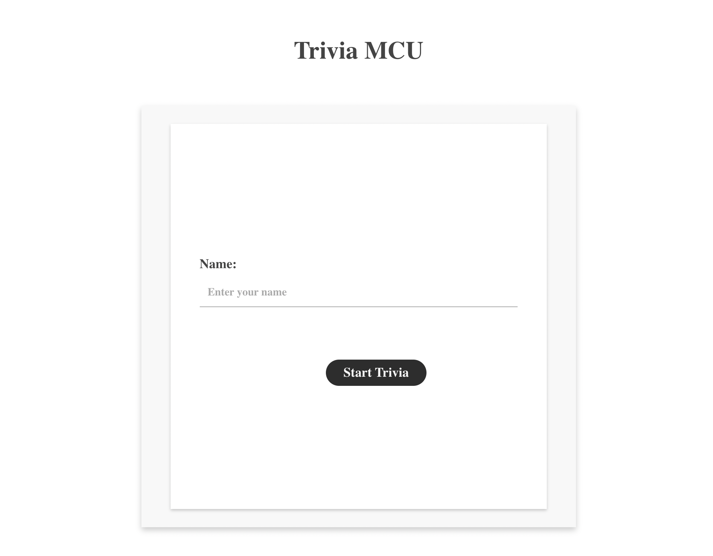
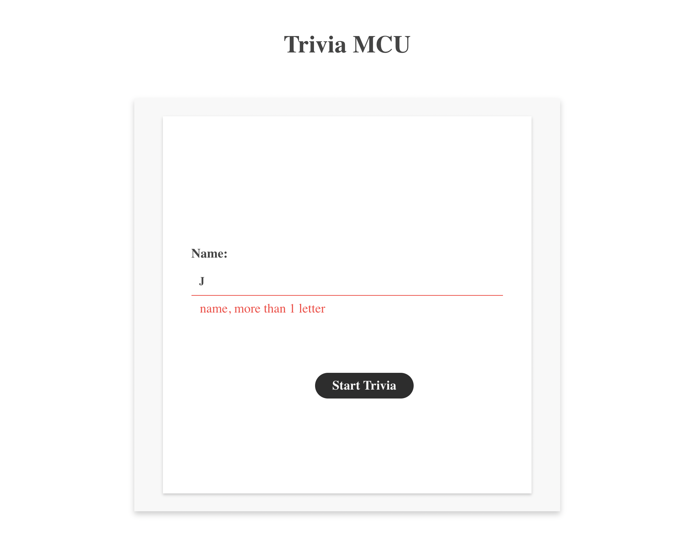
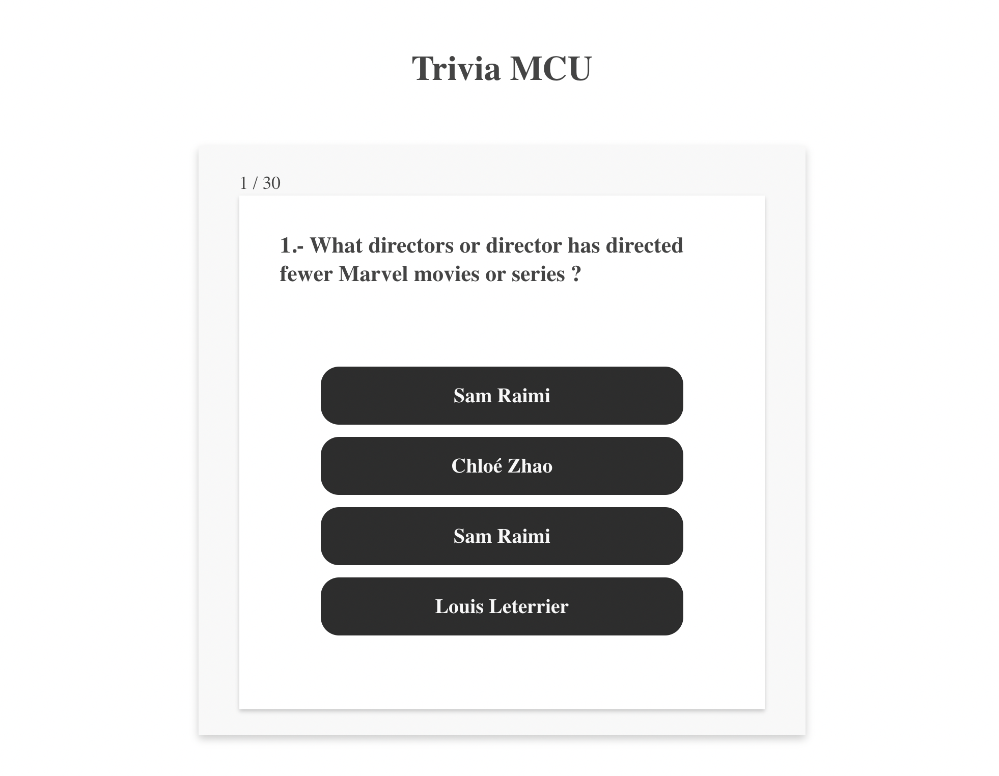
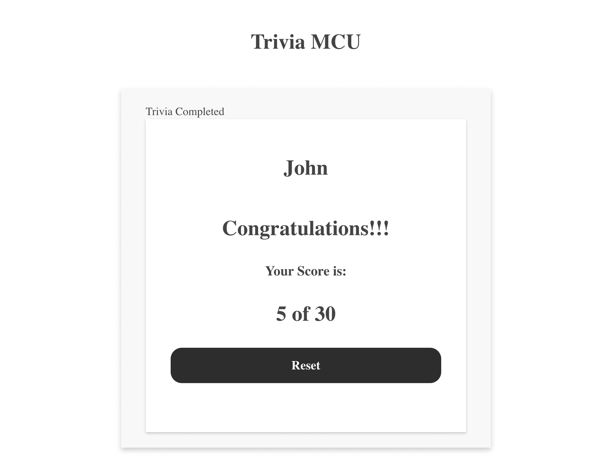

# mcu-trivia

It is a Marvel Cinematic Universe trivia game, using data from an API.

## Stack

- Typescript
- React context
- React router
- Axios
- Styled components
- Grommet
- Grommet icons

## Initial setup

1. ### install dependencies

All dependencies will be installed using the following command:

```
npm install
```

## Running the apps

It runs using the following command:

```
npm start
```

## Using the mcu-trivia app

Running in local, use the url http://localhost:3000/

1. ### User

It shows a form that allows introduce your name.



2. ### Validation

The name is required and it should be more than 1 character.



3. ### Questions

After introducing your name and clicking on the Start Trivia button, the app shows the first question.
When you click on one answer, immediately change to the next question.



4. ### Score

Finally, after answering the last question, it shows your score.
To restart the game, press the Reset button.



## Apps deployed

The app deployed is in the following URL:

[mcu-trivia](https://633e06c0d181891bb26ca6f0--mcu-trivia.netlify.app/)
